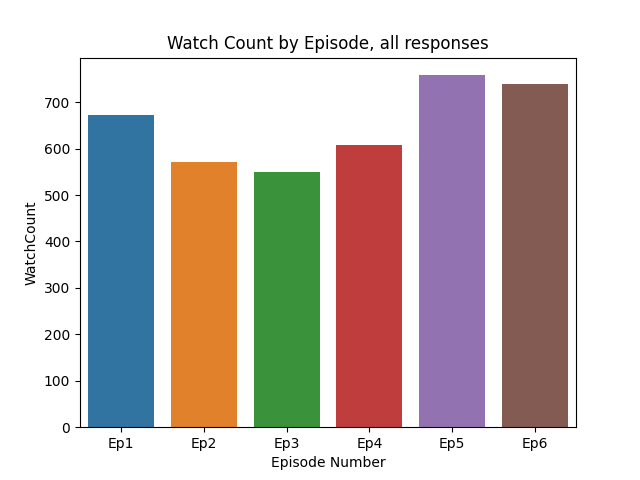

Exploratory data analysis  
Creates a bar chart of the watch count per each star wars episode totaled from all survey responses  

Creates a grouped bar plot of the rating of each star wars episode categorized by each income level group

Star wars data from Five Thirty Eight github.  

`pip install requirements.txt`